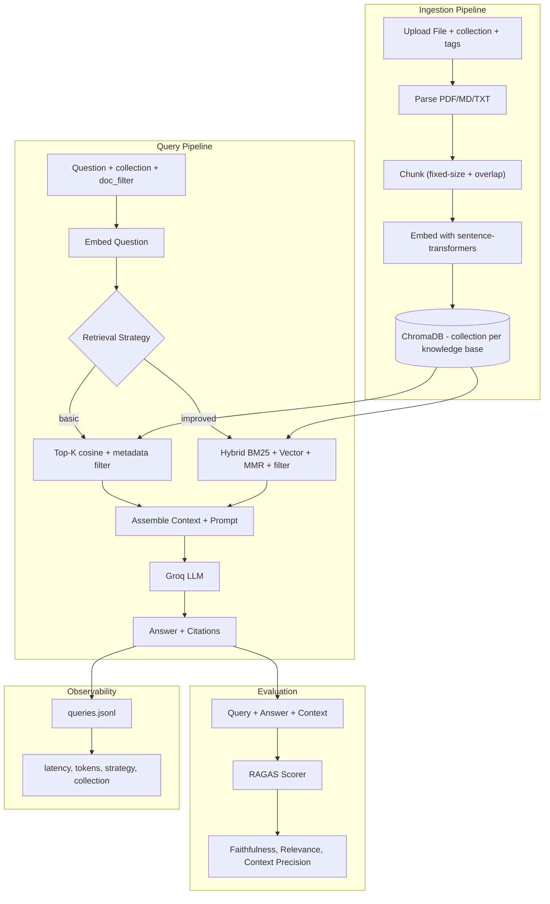
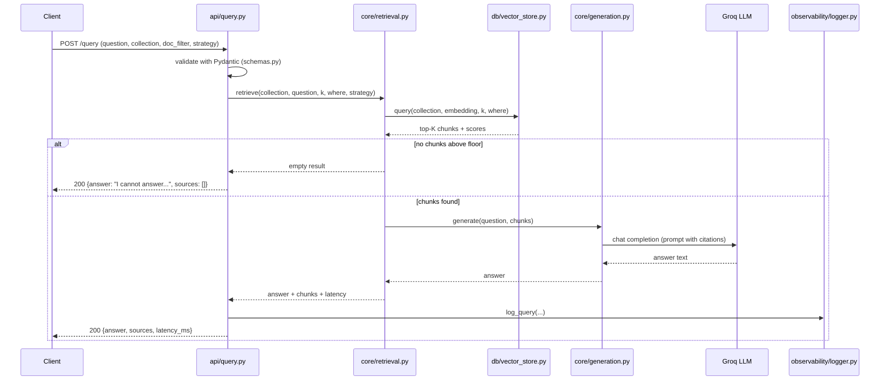

# Architecture

## High-level diagram



## Layered code structure

The project is intentionally three layers, with strict direction of
dependency: `api/ -> core/ -> db/`. Layers above never import from
layers below the wrong way around.

```
app/
├── api/             # HTTP layer (FastAPI routers, request/response)
├── core/            # Business logic (no FastAPI, no Chroma imports)
├── db/              # Persistence (the only place ChromaDB is touched)
├── observability/   # Logging adapters
├── schemas.py       # Pydantic models shared by api/ and core/
├── config.py        # Pydantic Settings (env-driven configuration)
└── main.py          # FastAPI app factory and wiring
```

Why these layers:

- **`api/`** is thin. It validates input with Pydantic, calls into
  `core/`, and serializes the result. Swapping FastAPI for another
  framework should not require changes outside `api/`.
- **`core/`** contains the actual RAG pipeline (ingestion, retrieval,
  generation, evaluation). It is testable without running an HTTP
  server and without a real ChromaDB or LLM (both are passed in via
  small interfaces).
- **`db/`** owns the ChromaDB client and is the only module that
  speaks Chroma's API. Replacing the vector store later means changing
  this directory only.

## Component responsibilities

| Component | File(s) | Responsibility |
| --- | --- | --- |
| Ingestion | `core/ingestion.py` | parse → chunk → embed → write to `db/` |
| Vector store | `db/vector_store.py` | manage collections, add/query/delete chunks |
| Retrieval | `core/retrieval.py` | implement `basic` and `improved` strategies on top of `db/` |
| Generation | `core/generation.py` | assemble prompt, call Groq, return answer |
| Evaluation | `core/evaluation.py` | wrap RAGAS, run a Q&A set, summarize scores |
| Observability | `observability/logger.py` | append-only JSONL writer + reader |
| Configuration | `config.py` | typed settings loaded from env |
| API | `api/*.py` | HTTP endpoints, error mapping |

## Request lifecycle: `POST /query`



## Cross-cutting concerns

### Configuration

All configuration lives in `app/config.py` as a Pydantic `Settings`
class loaded from environment variables (with `.env` support via
`python-dotenv`). Anything that varies by environment — model names,
ChromaDB path, top-K, similarity floor, log path — is a setting.
Hardcoded values in code are a smell.

### Error handling

A small set of custom exceptions in `app/core/exceptions.py`
(`CollectionNotFound`, `LLMUnavailable`, `IngestionError`) is mapped
to HTTP status codes by FastAPI exception handlers in `app/main.py`.
Layers below `api/` never raise `HTTPException` directly.

### Logging

Two logs:

1. **Query log**: append-only JSONL at `logs/queries.jsonl`. Written
   for every successful query. Used by `GET /logs`.
2. **Application log**: standard `logging` module to stdout, captured
   by Docker. Used for diagnostics, not queryable from the API.

### Persistence

- **ChromaDB** under `data/chroma/`, persistent between runs.
- **Query log** under `logs/queries.jsonl`, append-only.
- **Eval Q&A pairs** under `data/eval/qa_pairs.json`, hand-curated.

In Docker, both `data/` and `logs/` are mounted as volumes.

## Failure modes considered

| Failure | Detection | Behavior |
| --- | --- | --- |
| Unknown collection | `db/` returns `None` for `get_collection` | `404 CollectionNotFound` |
| Empty retrieval | `core/retrieval` returns `[]` | `200` with safe message, no LLM call |
| LLM 5xx / timeout | exception from Groq client | `502 LLMUnavailable` after one retry |
| Malformed upload | parser raises | `422 IngestionError` |
| Disk full / Chroma write fail | exception from `db/` | `500`, error logged |

## Why this shape (and not microservices)

For a corpus of thousands of chunks and a single user, splitting
ingestion, retrieval, and generation into separate services would add
operational complexity (network hops, contracts, deploy units) with
no real performance benefit. A single FastAPI process with clean
internal layering keeps the system understandable while making each
boundary swappable. If, later, ingestion needed to be a batch job and
the API needed to scale horizontally, the layered structure makes it
straightforward to extract `core/ingestion.py` into a worker.
